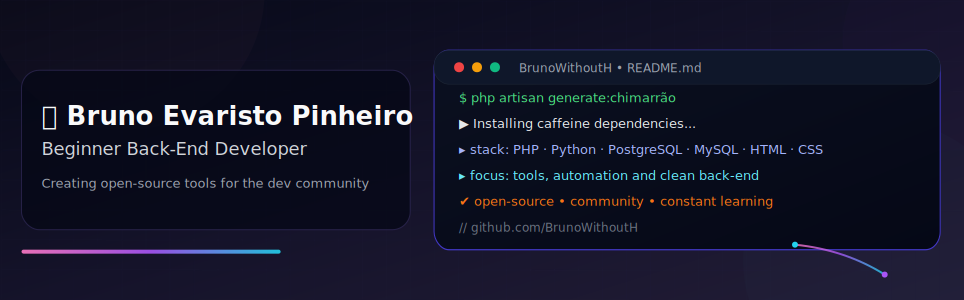

    
    
    

  
  

## ⚡ Sobre mim
👨🏻‍💻 Técnico em Informática pelo IFFar – Frederico Westphalen (3º ano).  
💻 Curto criar ferramentas open-source e resolver a parte do sistema que ninguém vê, mas todo mundo depende  
🌱 Sempre aberto a colaborar em projetos  
📩 Contato:  
 [pinheirobrunoevaristo@gmail.com](mailto:pinheirobrunoevaristo@gmail.com)  

## 💾 Technologies:

  

## 📊 GitHub Stats:
  
  
  
