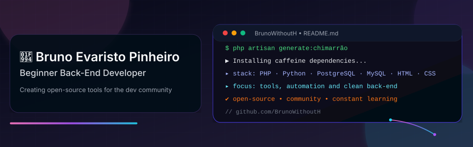

    
    
    

  
  

## ⚡ About

🎓 Computer Science student and Computer Technician at the Federal Institute of Farroupilha.

Solving the part of the system that no one sees, but everyone depends on.

Always open to collaborating on projects.

## 🏃 StrideBR

[**StrideBR**](https://github.com/BrunoWithoutH/StrideBR) is an open-source platform for planning, recording and tracking workouts and physical activities.

It started in 2024 as a project to help a friend organize his running activities and gradually grew into a broader training platform, with workout schedules, activity history, goals, exercise management, profiles, sharing and performance tracking.

🌐 [stridebr.alwaysdata.net](https://stridebr.alwaysdata.net)

## 💻 Tech

**Languages**
`Python` `PHP` `C` `JavaScript` `SQL`

**Data & Backend**
`PostgreSQL` `PDO` `REST APIs` `Data Modeling`

**Web**
`HTML` `CSS` `JavaScript`

**Systems & Tools**
`Linux` `Git` `GitHub` `Docker`

## 📚 Currently

* Studying **Computer Science**
* Building and improving **StrideBR**
* Learning more about **data engineering, backend development and system design**
* Experimenting with **Linux, self-hosting and homelab projects**

## 📖 Other projects

### [Dicioralho](https://github.com/BrunoWithoutH/Dicioralho)

A web dictionary dedicated to documenting Brazilian slang, expressions and profanity, with a focus on their meanings, context and everyday usage.
